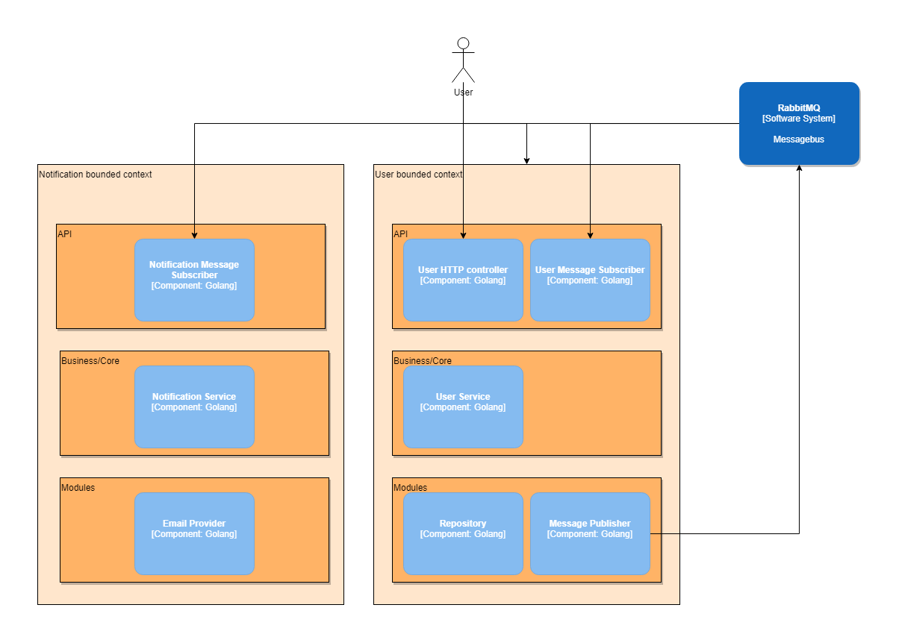

# Asiap API sample app

## Event Storming


## Diagram


## How to run

The whole environment can be run with:
```bash
docker-compose up
```

There is still an error when running application for the first time because of the connection for RabbitMQ is refused. The App has to be restarted to establish connection with RabbitMQ